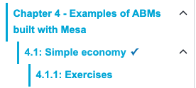

# sphinx-persistence

Save your readers' work in a Jupyter Book / TeachBooks / Sphinx website.

Without this extension, everything a reader does in an interactive book is
gone the moment they refresh or close the page: quiz answers, code they
edited, exercises they filled in. With this extension, all of it comes back
when they return, even days later. Everything is stored in the reader's own
browser. There is no server, no account, and no data ever leaves their
computer.

## Install

Two lines, then rebuild your book.

**1.** Add to your book's `requirements.txt`:

```
sphinx-persistence @ git+https://github.com/omarkammouh/sphinx-persistence
```

**2.** Add to your book's `_config.yml`:

```yaml
sphinx:
  extra_extensions:
    - sphinx_persistence
```

That is all. For a plain Sphinx project (no Jupyter Book), add
`"sphinx_persistence"` to the `extensions` list in `conf.py` instead.

## Features

### Automatic saving, no save button

Anything a reader types or selects is saved as they go: text boxes, text
areas, checkboxes, radio buttons, dropdowns and sliders. Saving happens
quietly in the background a moment after each change, and once more when the
reader leaves the page, so nothing is lost by closing the tab mid-sentence.
When they come back to the page, every field is filled in exactly as they
left it. Fields that appear later (for example, added by a script after the
page loads) are picked up automatically too.

### Live code cells

If your book has executable code cells (thebe / "Live Code"), the code a
reader writes or changes in a cell is saved and put back the next time they
open the page. Only the code is saved, not the output; the reader simply runs
the cell again.

There is a safety net for when you update your book: each saved edit
remembers what the original cell looked like. If you later change that cell
in a new version of the book, the old saved edit no longer matches and is
quietly skipped instead of being pasted into the wrong place. Readers never
see their code appear in a cell where it does not belong.

### Quiz answers

Answers to TeachBooks-Questions quizzes are saved: which option the reader
picked in a multiple-choice question, and what they typed into math answer
fields. On reload the answer is selected again. The feedback (correct /
incorrect) is not replayed; the reader can press Check again to see it.

### Custom HTML activities

Many books contain small hand-made exercises written directly in HTML:
sorting exercises, matching exercises, click-to-classify games and similar.
These normally cannot be saved from the outside, because they keep their
state in their own private code. This extension solves that in a simple way:
it records the clicks the reader makes inside the activity, and on reload it
replays those clicks. The activity rebuilds itself step by step, including
the graded result if the reader had pressed Check. No changes to the
activities themselves are needed.

### Progress tracking

Each page ends with a small checkbox the reader can tick when they are done
with it:


Ticked pages get a checkmark in the sidebar, so readers see at a glance how
far they are in the book:



For long tutorial pages you can additionally give each numbered section its
own checkbox (see the `persistence_part_heading_pages` setting below). If you
do not want progress tracking at all, one setting turns it off.

### Export and Import

Saved progress lives in one browser on one computer. The Export and Import
buttons are the bridge between machines: Export downloads a single file with
all progress in the whole book; Import loads such a file back in. A student
can work in the university library, export, and continue at home. The file
also doubles as a backup.


Import is careful: if the file comes from a different book, the reader gets a
clear warning first, and code edits that no longer match the current version
of the book are skipped rather than restored into the wrong place.

### Reset

The Reset button lets a reader start over. It asks whether to clear just the
current page or the entire book, then wipes the saved data and reloads the
page in its original state. It only ever touches this extension's own data.

## What does not get saved

- The output of code cells. Only the code is saved; running it again brings
  the output back.
- Anything inside an iframe from another website (YouTube, H5P on h5p.com,
  and so on). Browsers do not allow a page to look inside those.
- Canvas animations and games. They restart on purpose.
- Which tab of a tab-set was open.

## Settings

Everything works with no settings at all. If you want to change something,
add any of these under `sphinx: config:` in `_config.yml`:

| Setting | Default | What it does |
|---|---|---|
| `persistence_toolbar` | `true` | Show the Export / Import / Reset buttons |
| `persistence_code_cells` | `true` | Save edits in live-code cells |
| `persistence_questions` | `true` | Save TeachBooks-Questions answers |
| `persistence_activities` | `true` | Save custom HTML activities |
| `persistence_progress_checkboxes` | `true` | "Mark as done" checkboxes and sidebar checkmarks |
| `persistence_part_heading_pages` | `""` | On pages matching this pattern, numbered section headings also get a checkbox (for example `"chapter_3\|chapter_4"`) |
| `persistence_activity_exclude_ids` | `[]` | Activities that should never be saved (for example timed games) |
| `persistence_book_id` | `""` | A name for your book, so importing a progress file from a different book shows a warning |

## Good to know

- Progress is saved per browser, per computer. To move it, use Export on one
  machine and Import on the other.
- Browsers give a website about 5 MB of storage. If a reader ever fills it,
  they get a warning instead of silent data loss.
- Reset never touches other data of the website, only what this extension
  saved.

## Development

The JavaScript lives in `src/sphinx_persistence/static/`. Sphinx serves the
installed copy, so after editing, reinstall from your checkout before
rebuilding the site you test against:

```
pip install --force-reinstall --no-deps /path/to/sphinx-persistence
```

## License

MIT
